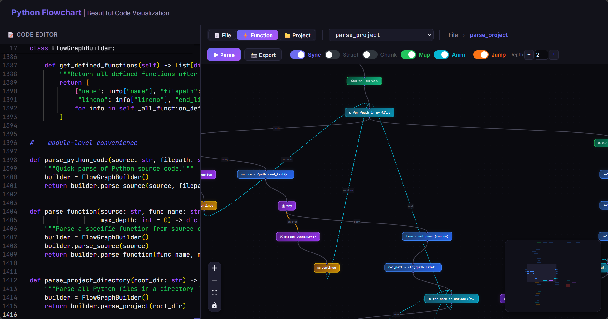
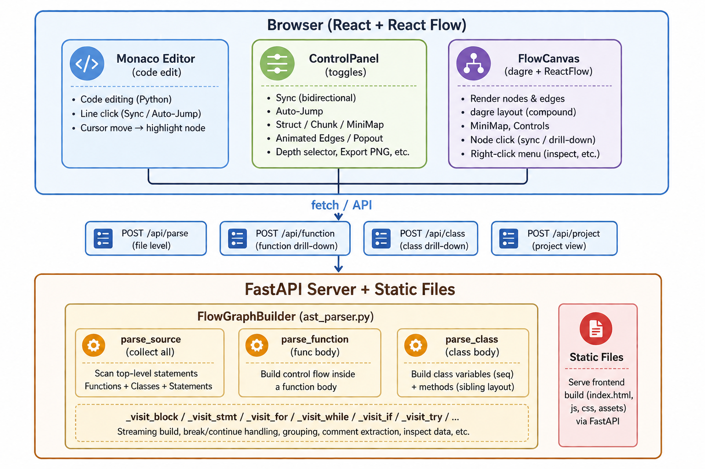

# Python Flowchart

[](README.md)
[](README.zh.md)

> **Python Flowchart** — Visual code-to-flowchart tool. Supports File / Function / Class / Project views, bidirectional Sync, dual-monitor Popout, Auto-Jump, and rich right-click interactions.



---

## Python Flowchart — Visual Code-to-Flowchart Tool

Generate **interactive flowcharts** from Python source code. Supports **File / Function / Class / Project** views, double-click drill-down, bidirectional code↔flow **Sync**, **dual-monitor Popout**, **Auto-Jump**, and rich right-click interactions.

---

## Quick Start

### Launch

```bash
# 1. Install backend dependencies
pip install -r requirements.txt

# 2. Install frontend dependencies
cd frontend
NODE_ENV=development npm install

# 3. Build frontend
NODE_ENV=development npm run build

# 4. Start server
cd ..
python server.py
```

Open **http://localhost:8765** in your browser.

### Usage

| Action | Effect |
|--------|--------|
| Paste code on the left, click **Parse** (or `Ctrl+Enter`) | Generate file-level flowchart |
| Click a function/class node | Drill down into its internal flowchart |
| Right-click background → `📍 Go to start` | Jump to the current view's Entry node |
| Right-click a node → `📍 Find definition` | Jump to the parent structural node (if/while) |
| Click a node (Sync ON) | Code editor jumps to the corresponding line |
| Click a code line (Sync ON) | Flowchart centers and highlights the node |
| Turn ON `⏩ Jump` → click a code line | Auto-navigate to the function containing that line |

---

## Features

### View Modes

| Mode | Description |
|------|-------------|
| **File** | All top-level functions + classes + statements. Each function/class is a clickable node |
| **Function** | The full control flow inside a single function (if/for/while/try/break/continue) |
| **Class** | Class variables (sequential) + methods (sibling layout). Methods are drill-down-able |
| **Project** | Cross-file function call graph |

### Node Types

| Node | Color | Description |
|------|-------|-------------|
| Entry | 🟢 Green | Function/file entry |
| Exit | 🔴 Red | return / exit |
| Statement | 🔵 Blue | Regular statement |
| Condition | 🟡 Orange | if/elif branch |
| Loop | 🟢 Cyan | for/while loop |
| Try/Except | 🟣 Purple | Exception handling |
| Call | 🟣 Purple | Function call (drill-down-able) |
| Break | 🟠 Dark orange | break statement |
| Continue | 🟡 Yellow | continue statement |
| Comment | 🌿 Dark green | Comment/docstring (expandable/collapsible) |
| Class | 🟤 Dark purple | Class node (drill-down-able) |
| GroupBox | Dashed rectangle | Structural / chunk grouping |

### Control Flow Logic

- **break** → edge points to the first node AFTER the loop (correct exit)
- **continue** → edge points back to the loop header (for/while start)
- **if/elif/else** → True/False branches, green/red edges
- **try/except** → Exception edge (orange)
- **loop back** → Dashed cyan edge with marching ants animation (toggle-able)

### Interactive Features

#### 🔗 Sync (Bidirectional)

Toggle (default OFF). When ON:
- Click a flowchart node → code editor jumps to that line
- Move cursor in code → flowchart highlights and centers the node
- **Single click = sync / Double click = drill-down** — separate operations prevent conflict

#### ⏩ Auto-Jump

Toggle (default OFF, orange style). When ON:
- Click a code line that is NOT in the current flowchart → auto-find the containing function → navigate to its flowchart and highlight the node
- **Case 1**: line outside current view → auto-jump to target function
- **Case 2**: line already in current view → just center/highlight (no jump)

**Depth selector**: number input (1–10, with +/- buttons). Controls how many structural levels up to search.

#### 🗺️ MiniMap

Toggle (default ON). React Flow MiniMap in the bottom-right corner for bird's-eye navigation.

#### 🐜 Animated Edges

Toggle (default ON). When OFF, loop-back edges render as static lines — better performance on large graphs.

#### 📦 Struct / Chunk Groups

- **Struct Groups**: Structural nodes (while/for/if/try) wrap their bodies in dashed rectangle boxes, keeping child nodes contained
- **Chunk Groups**: Consecutive same-type statements merge into blocks
- dagre `{ compound: true }` + `g.setParent()` keeps child nodes within parent group bounds

#### ⇱ Popout (Dual Monitor)

- Click button → opens a separate window with the **full right panel** (ControlPanel + FlowCanvas + all buttons)
- The **main window shows only the code editor**
- Closing the Popout window → main window restores left-right layout
- **Sync works across windows**: cursor in main window → Popout highlights; node click in Popout → main window jumps to code line
- All operations are executed by the main window (single source of truth), with results synced via `postMessage`

#### 🔍 Inspect

Right-click a node that has inspect data (return, function call, etc.) → popup shows structured content (dict/list/arguments). The backend recursively extracts AST values via `_extract_inspect()`.

#### 📸 Export PNG

Export the current flowchart as a PNG image.

#### Right-Click Context Menu

| Action | Target |
|--------|--------|
| 📖 Expand / 📕 Collapse | Comment nodes |
| View block | while/for/if/try nodes — show block content in isolation |
| 🔍 View method | Class method nodes |
| 🔍 Inspect value | Nodes with inspectable data (return/call) |
| 📍 Find definition | Any non-entry node — jump to parent structural node |
| 📍 Go to start | Blank background — jump to Entry |

### Zoom & Viewport

- All navigation (Sync, Go to start, Find definition, block isolation) uses `setCenter(x, y, { zoom })`, **preserving the user's current zoom level**
- `fitView` is called once on initial load; subsequent operations never reset zoom
- React Flow Controls (zoom/lock/fit buttons) are dark-themed to match the UI

---

## Tech Stack

### Frontend

| Technology | Purpose |
|------------|---------|
| **React 18** | UI framework |
| **TypeScript** | Type safety |
| **React Flow (@xyflow/react)** | Flowchart rendering + dagre layout + MiniMap + Controls + interaction |
| **Monaco Editor (@monaco-editor/react)** | Code editor (VS Code engine) |
| **Vite** | Build tool |
| **dagre** | Directed graph auto-layout (DAG layering) |
| **html-to-image** | PNG export |

### Backend

| Technology | Purpose |
|------------|---------|
| **Python 3.13+** | Runtime |
| **FastAPI** | REST API framework |
| **UVicorn** | ASGI server |
| **Python AST (ast)** | Static source analysis (stdlib) |
| **tokenize** | Comment extraction (stdlib) |

### Architecture



### Data Flow

```
Python source → AST → FlowGraphBuilder (multi-pass)
                ↓
    JSON { nodes, edges, blocks }
                ↓
React Flow (dagre layout → render)
                ↓
User interaction → main window processes → result synced to Popout
```

---

## Dependencies

### Backend (requirements.txt)

| Package | Purpose |
|---------|---------|
| fastapi | Web API framework |
| uvicorn | ASGI server |
| pydantic | Request/response model validation |

### Frontend (package.json)

| Package | Purpose |
|---------|---------|
| react, react-dom | UI framework |
| @xyflow/react | Flowchart engine (React Flow) |
| @monaco-editor/react | Code editor |
| dagre | Directed graph layout |
| typescript | Type checking |
| vite | Build tool |
| html-to-image | PNG export |
| @vitejs/plugin-react | Vite React support |

### Standard Library (zero external deps)

| Module | Purpose |
|--------|---------|
| ast | Python abstract syntax tree parsing |
| tokenize | Lexical analysis (comment extraction) |
| json | Serialization |
| typing | Type hints |
| tempfile | Temporary files (testing) |
| multiprocessing | Process isolation (Hermes test system) |

---

## Project Structure

```
E:\Coding\Test\Paint/
├── parser/
│   ├── __init__.py
│   └── ast_parser.py        # Core AST parser (~1400 lines)
├── frontend/
│   ├── index.html
│   ├── package.json
│   ├── tsconfig.json
│   ├── vite.config.ts
│   ├── src/
│   │   ├── main.tsx          # React entry
│   │   ├── App.tsx           # Main component (~740 lines)
│   │   ├── App.css           # Dark theme styles
│   │   ├── types.ts          # TypeScript type definitions
│   │   ├── api.ts            # API layer
│   │   ├── popout-sync.ts    # Cross-window sync (postMessage)
│   │   ├── components/
│   │   │   ├── FlowCanvas.tsx    # Flowchart renderer (~780 lines)
│   │   │   ├── CustomNodes.tsx   # Custom node components
│   │   │   ├── CodeEditor.tsx    # Monaco editor wrapper
│   │   │   └── ControlPanel.tsx  # Control panel (~440 lines)
│   │   └── vite-env.d.ts
│   ├── dist/                 # Build output
│   └── node_modules/
├── server.py                 # FastAPI server (~120 lines)
├── requirements.txt
├── start.sh / start.bat      # Launch scripts
├── .gitignore
├── README.md                 # This file (English)
├── README.zh.md              # 中文版本
└── README.md
```

---

## Core Parser Architecture (ast_parser.py)

### Multi-Pass Scanning

1. **First pass — `_collect_definitions`**: `ast.walk()` collects all function and class definitions: `name`, `lineno`, `end_lineno`, `ast_node`
2. **Second pass — `parse_source`**: Walk top-level statements, build the file-level flowchart
3. **Third pass — `parse_function` / `parse_class`**: Drill into a function/class body to build its internal flowchart

### `_visit_block` Streaming Build

```
results = []
for stmt in body:
    entry, exits = _visit_with_comments(stmt)
    results.append((entry, exits))

# Chain results (skip break/continue forward chaining)
for i, (entry, exits) in enumerate(results):
    if not _is_break_or_continue(entry):
        for exit_id in previous_exits:
            add_edge(exit_id, entry)
```

- Each statement returns `(first_node_id, exit_node_ids)`
- The previous statement's exits connect to the next statement's entry
- **break/continue** are collected separately: break → outside loop, continue → back to loop header
- **Loop back**: normal body exits connect back to the loop head node

### Grouping (`_start_block` / `_end_block`)

```
_start_block("while", "while body")
body_first, body_exits = _visit_block(stmt.body)
_end_block()
```

- All blocks are always tagged with a hierarchical `blockId` (e.g., `block_0_1` → `block_0`)
- The frontend controls whether group boxes are visually rendered
- dagre `{ compound: true }` + `g.setParent()` keeps children within parent boundary

### Comment Extraction

- Uses Python's `tokenize` module to extract comments from the source
- Consecutive single-line `#` comments are merged into blocks
- Docstrings are detected via `ast.Expr(ast.Constant)` and skip duplicate parsing
- Function-level filtering: only comments inside a function are shown

---

## Known Limitations

- Python 3.7 or earlier is not supported (requires `end_lineno`)
- Dynamic code execution: static AST analysis only, no runtime
- Cross-file import analysis is not supported (Project view scans function signatures only)
- Large graphs (500+ nodes) may experience performance overhead from React Flow and dagre layout
- Search Depth (auto-jump nesting level) currently supports function-level jumps only; for/while structural-level Entry is planned

---

## Development Notes

### Frontend Build

```bash
cd frontend
NODE_ENV=development npm run build        # Full build
NODE_ENV=development npm run typecheck    # TypeScript check
NODE_ENV=development npm run dev          # Vite watch mode
```

### Windows Notes

- Use `bash` (git-bash / MSYS), NOT PowerShell
- `NODE_ENV=development` must be explicitly set per-command
- Kill port: `netstat -ano | grep ':8765' | awk '{print $5}' | xargs -I{} taskkill //F //PID {}`

### Server

```bash
python server.py
# Listens on http://0.0.0.0:8765
```

### Popout Communication Protocol

| Message Type | Direction | Content |
|-------------|-----------|---------|
| `graphState` | Main → Popout | nodes, edges, blocks |
| `uiState` | Main → Popout | sync, struct, chunk, minimap, code, functions, viewMode, breadcrumbs, maxDepth |
| `cursorMove` | Main → Popout | line number |
| `nodeClick` | Popout → Main | lineNo (only when sync ON) |
| `toggle*` | Popout → Main | Main window toggles and syncs back |
| `parseFile / drillDown / etc.` | Popout → Main | All operations executed by main window |

---

## License

MIT — Free to use, modify, and distribute.
